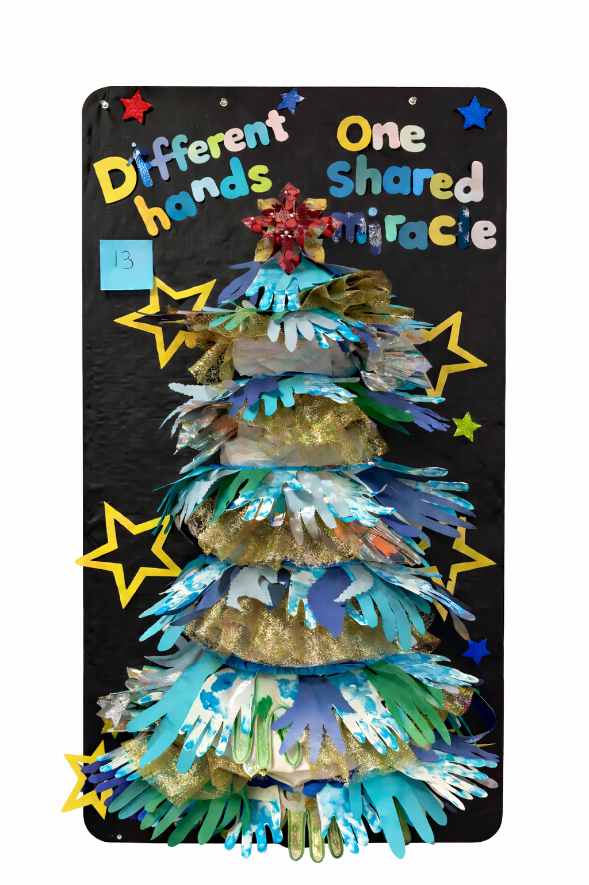

<figure style="float:left; width:60%; margin:-5.8rem 1.2rem 1rem 0;">

<figcaption style="text-align:center; font-size:0.9em; color:#666; margin-top:-2rem;"><em>Art project created by SPED students</em></figcaption>
</figure>

The logo for my [*PARA Welcome Kit*](/tags/para-welcome-kit) is made of colorful children’s handprints. It’s simple, warm, and very real, because it grew directly out of my everyday life in SPED.

Every year, our schools host a holiday poster contest. This year, I suggested using handprints for a creative project from our SPED department. The idea came naturally, shaped by everything I've learned and lived while working with my students. We turned it into a shared experience: we gently dipped students' hands into paint, and one by one, they left their handprints on paper. Our role was simply to support, cut, and assemble the pieces into a single artwork.

What mattered most wasn't the final poster (though it turned out beautiful). What mattered was the process. It was joyful, sensory, playful, and deeply human. For our students, it was learning through movement and touch. For us, it was a reminder that inclusion is not a slogan or a policy. It's a moment-by-moment practice.

The phrase **"Different hands—one shared miracle"** came to me just as organically. Each handprint was unique—different size, shape, pressure, color. Together, they formed something whole. That’s how I understand special education: not as a system that tries to make everyone the same, but as a space where differences are honored and brought together.

This is why I chose handprints as the visual language for my [*PARA Welcome Kit*](/tags/para-welcome-kit). PARAs work closest to students. We see the small things: the ways hands fidget, flap, reach out, pull back, explore. Hands tell stories before words do. They remind us that learning happens through bodies, relationships, and trust.

I’m sharing this project here on my professional site as a future SPED teacher because it reflects how I understand my work. Inclusion doesn’t always look like something “big.” Sometimes it looks like paint on small hands, laughter in the classroom, and a group of very different students creating something together.

Different hands. One shared miracle.

**[Explore the PARA Welcome Kit →](/projects/para-welcome-book)**

[//]: # ()